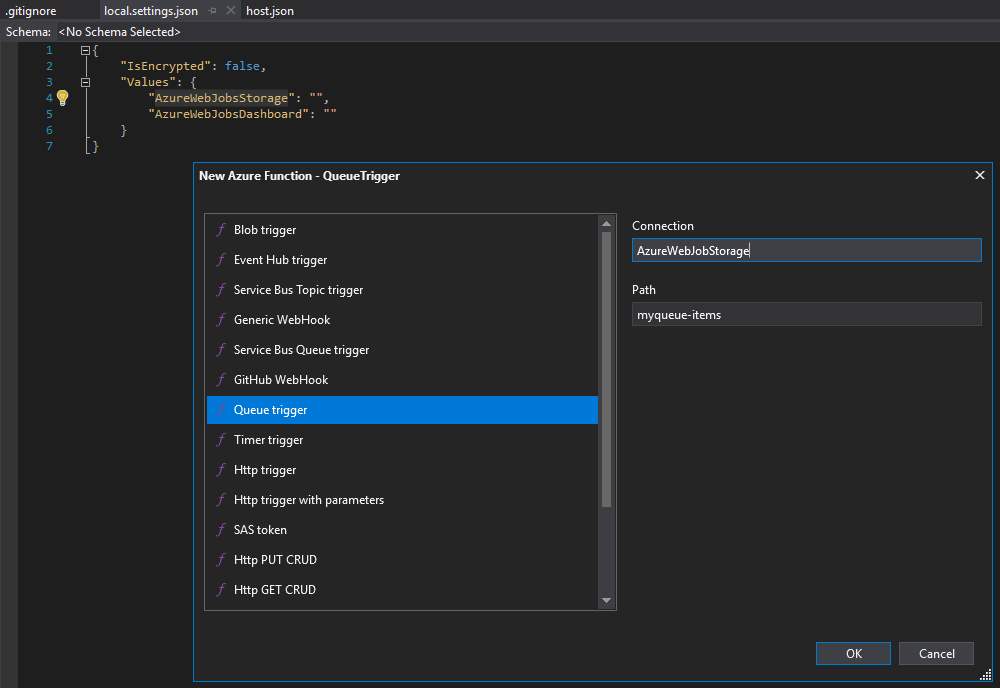
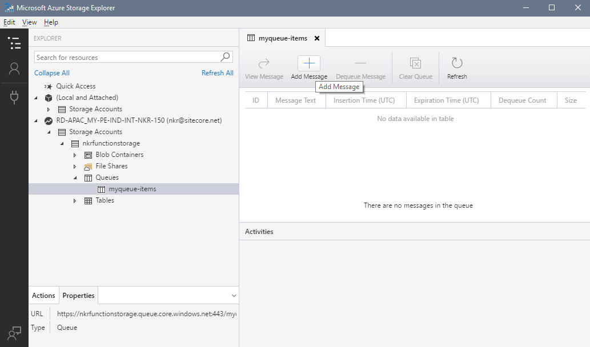
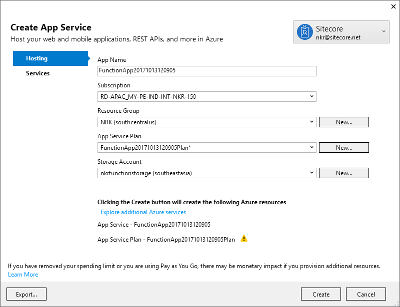
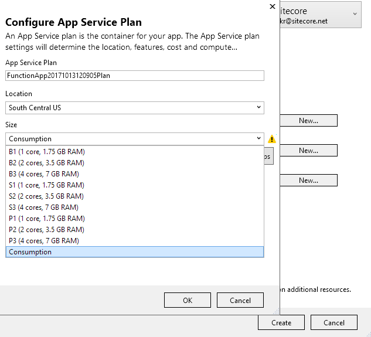

# Azure Function Demo
Azure Development workload should be installed in Visual Studio

References:
1. https://channel9.msdn.com/Blogs/dotnet/NET-Core-20-Released?term=.net%20core%202#time=0h29m20s
2. https://docs.microsoft.com/en-us/azure/azure-functions/


- **Create a new _Cloud \ Azure Function_ project**

With host.json you can configure settings.
We are going to create queue trigger. We are going to push things in the queue, pick them and process them.
We got an Azure Table Storage with a queue inside it and whenever a new even pushes into the queue the Azure function will be called.
```
{
    "queues": { "maxPollingInterval": 1000 }
}
```
In Visual Studio there is a schema for the host.json which enables us to use intellicense.

local.settings.json stores the settings like connection strings and so on.

`AzureWebJobsStorage` is required as it is the storage account the Azure Function is working with.

- **Create Function App in Azure Portal**

After creating this, copy and paste the storage connection string to the Azure Function local.settings.json

```
{
    "IsEncrypted": false,
    "Values": {
        "AzureWebJobsStorage": [Storage Connection String],
        "AzureWebJobsDashboard": ""
    }
}
```

- **Add an Azure Function to the solution**

This brings you a dialog which you can select what type of function you wanna develop.



When you start the solution it will start the local Azure Function Emulator.

- **Add a message to queue**

Use Azure Storage Explorer and push a message. If you start your project the Run method will be triggered and you can see me message you have added to the queue.



- **Deploy Solution to Azure**

Right click on the solution and click Publish.



Take note that with Azure functions you can select Consumption based plan.



Navigate to the Azure portal and see that the Function App is created.
If you push another message to the queue you can see that the logs will be updated.


